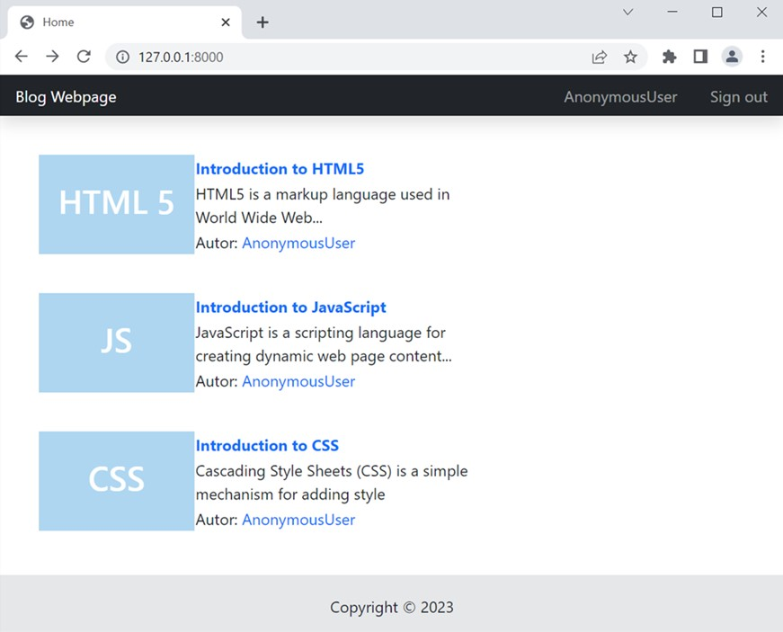

# Blog Webpage
This project aim to demostrate how Blog webpage can be developed using Python + Django
 
Page with Details
 

To add more topics use the follow link [http://127.0.0.1:8000/contents/create_content/]

 

## To run the project

Type in commandline

### `py manage.py runserver`

Server will be running on [http://127.0.0.1:8000]

