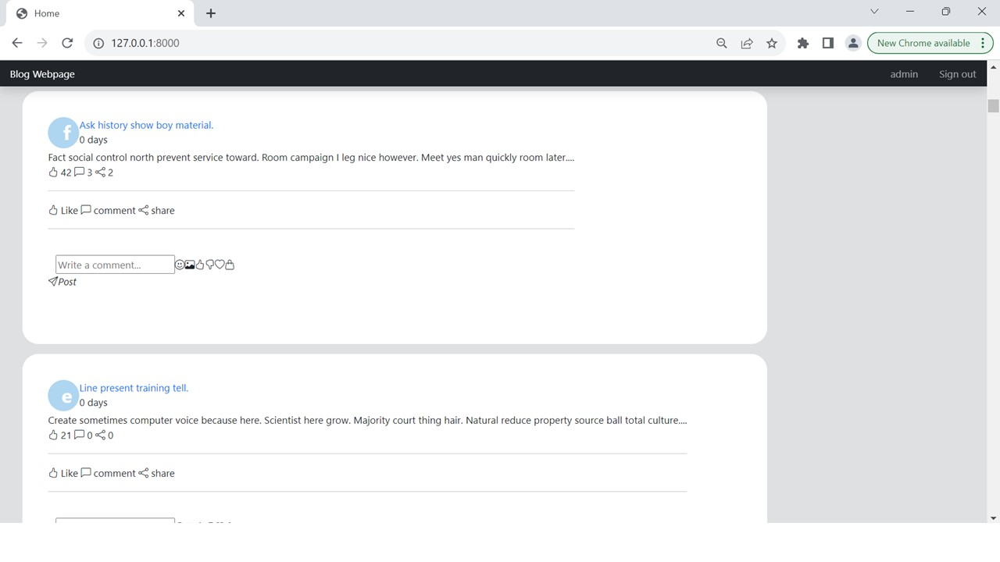

# Blog Webpage
This project aim to demostrate how Blog webpage can be developed using Python + Django

In the Home page are all posts of users

Clicking the user icon, posts of the specific user is displayed

Clicking the title of post, the post is displayed

## To run the project

Type in commandline

### `py manage.py migrate`

### `py manage.py runserver`

Server will be running on [http://127.0.0.1:8000]

